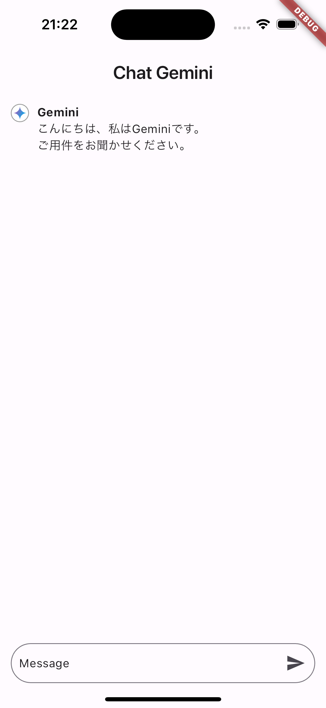
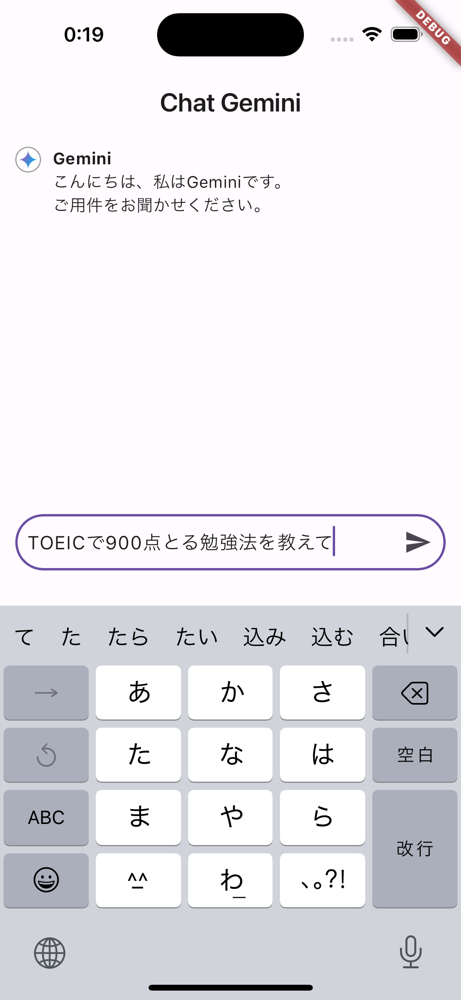
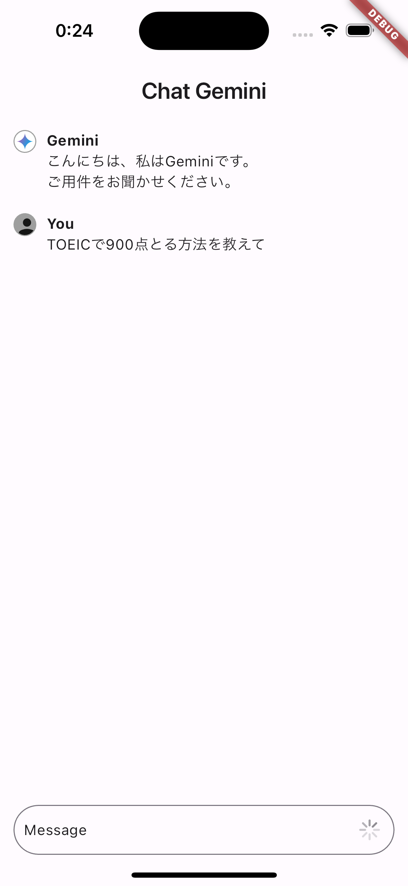
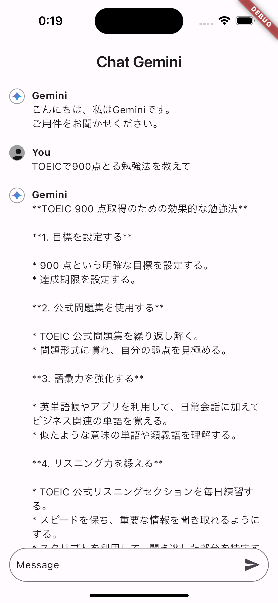
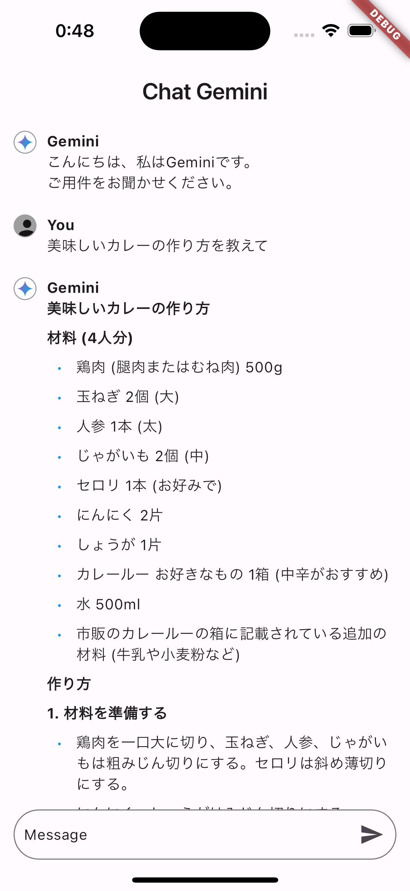

# Gemini Chat App　

[Gemini](https://gemini.google.com/app)（対話型AI）のAPIを使用したAIとのチャットアプリです。

※ API の練習用

### アプリの見た目
↓ メインページ

 

↓ 使用例

#### 追記

flutter_markdown パッケージを使用して、チャットのメッセージをMarkdown形式で表示するように変更しました。

↓ 変更後の見た目

---

### 使用した技術
|カテゴリ |技術 |
|:---:|:---:|
| フロントエンド | Flutter |
| 状態管理 | riverpod |
| API | Gemini |
|APIkeyの難読化 | envied | 

---

### 最後に
プロジェクトをご覧いただき、ありがとうございます。
